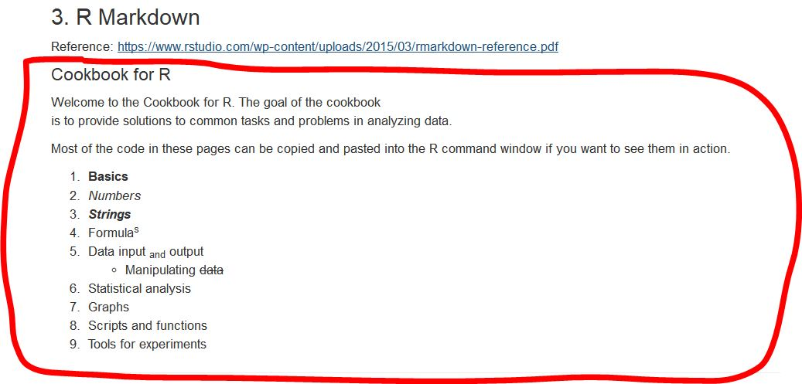

```{r setup, include=FALSE}
knitr::opts_chunk$set(echo = TRUE)
```


### 1. Changing the author field and file name.
(a) Change the `author`: field on the Rmd document from Your Name Here to your own name.
(b) Rename this file to "lab01_YourHameHere.Rmd", where YourNameHere is changed to your own name.

### 2. Hello World!
Here's an R code chunk that prints the text "Hello world!"
```{r print}
# language chunkName , option(s)
print("Hello world!")
```

(a) Create **3** code chunks below: 
  (1) name them `printYourName1`, `printYourName2`, `printYourName3`;
  (2) add option `eval=FALSE`, `echo=FALSE` and `collapse=TRUE` respectively;
  (3) and print YourName1, YourName2, YourName3 in the chunks respectively

```{r printYourName1, eval=FALSE}
print("ChanPokWah1")
```
```{r printYourName2, echo=FALSE}
print("ChanPokWah2")
```
```{r printYourName3, collapse=TRUE}
print("ChanPokWah3")
```

--------------------
Do it here


### 3. R Markdown

Reference: https://www.rstudio.com/wp-content/uploads/2015/03/rmarkdown-reference.pdf

Browse the reference link above, edit the follow content with suitable syntax, and make the output like this:
image:


## Cookbook for R
Welcome to the Cookbook for R. The goal of the cookbook  
is to provide solutions to common tasks and problems in analyzing data.  


Most of the code in these pages can be copied and pasted into the R command window if you want to see them in action.  

1. **Basics**  
2. *Numbers*  
3. ***Strings***  
5. Formulas^S^  
5. Data input ~and~ output  
    + Manipulating ~~data~~  
6. Statistical analysis  
7. Graphs  
8. Scripts and functions  
9. Tools for experiments  

