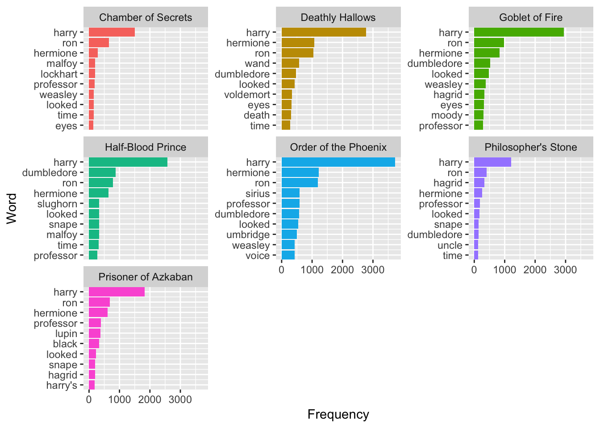

```{r setup, include=FALSE}
knitr::opts_chunk$set(echo = TRUE, warning = FALSE, message = FALSE)
```

Before proceeding to the exercise, make sure the `tidyverse` and the `tidytext` package are installed in your lab computer.

In this lab, we are going to use the data provided in the `harrypotter` package, which contains the first 7 novels in the Harry Potter series, to practice the basics of text tidying and sentiment analysis. 

The `harrypotter` package is hosted on **GitHub** (rather than **CRAN**), the world's most popular web-based software version control system. To install R packages hosted on GitHub, we need to use the `install_github()` function provided by the `devtools` package, a package that facilitates developing and distributing R packages.

```{r eval=FALSE}
install.packages("devtools")
```

Once the `devtools` is installed, we install the the `harrypotter` package by executing the following code:
 
```{r eval=FALSE}
devtools::install_github("bradleyboehmke/harrypotter") 
```

Then we load all packages needed for this exercise:

```{r}
library(tidyverse)      
library(tidytext)       
library(harrypotter)   
```

The 7 novels we are working with include:

- `philosophers_stone`: Harry Potter and the Philosophers Stone (1997)
- `chamber_of_secrets`: Harry Potter and the Chamber of Secrets (1998)
- `prisoner_of_azkaban`: Harry Potter and the Prisoner of Azkaban (1999)
- `goblet_of_fire`: Harry Potter and the Goblet of Fire (2000)
- `order_of_the_phoenix`: Harry Potter and the Order of the Phoenix (2003)
- `half_blood_prince`: Harry Potter and the Half-Blood Prince (2005)
- `deathly_hallows`: Harry Potter and the Deathly Hallows (2007)

Each object is a character vector with each element representing a single chapter. For instance, 

```{r eval=FALSE}
philosophers_stone[2]
```

gives the raw text of the second chapter of `philosophers_stone`.

To properly analyze this text, we want to turn it into a tibble:

```{r}
(book1 <- tibble(chapter = seq_along(philosophers_stone), text = philosophers_stone))
```

This creates a 2-column tibble. The first column gives the chapter number, and the second column contains the full text for each chapter.

To tokenize the text, we can unnest these texts by using  `unnest_tokens` introduced in our lecture:

```{r }
book1 %>% unnest_tokens(word, text)
```


In order to analyze text of all 7 novels, we first execute the following commands to create several data objects that will be used in the subsequent analysis.

```{r}
titles <- c("Philosopher's Stone", "Chamber of Secrets", "Prisoner of Azkaban", "Goblet of Fire", "Order of the Phoenix", "Half-Blood Prince", "Deathly Hallows")

books <- list(philosophers_stone, chamber_of_secrets, prisoner_of_azkaban,
           goblet_of_fire, order_of_the_phoenix, half_blood_prince,
           deathly_hallows)
books
```

We want to use the `bookseries` variable to maintain the tibble that contains words across all 7 novels. We use `purrr:map()`, which is a tidy version of `lapply()`, to do so:

```{r}
  # name each list element
bookseries <- books %>% set_names(titles) %>%  
  # convert each book to a data frame and merge into a single data frame
  map_dfr(as_tibble, .id = "book") %>%
  # create a chapter id column
  group_by(book) %>%
  mutate(chapter = row_number(book)) %>% ungroup() %>%
  # tokenize the data frame
  unnest_tokens(word, value)
bookseries 
```

We now have a tidy tibble with every individual word by chapter by book. We can now proceed to perform some simple word frequency analyses.


Remove stop words (kept in the `stop_words` dataset of the `tidytext` package) with `anti_join()` as we did in the lecture, and assign the resulting tibble to a new variable `bookseries_rm`. 


```{r }

## Edit Here

bookseries_rm <- bookseries %>% anti_join(stop_words)
bookseries_rm

```

We can use `count()` to assess the most common words for each book in the tidy dataset, and then extract the top 10 most common words in each book using the `top_n()` command in `dplyr`. The top 10 most common words will then be assigned to a variable `topwords_by_book`:


```{r  }

## Edit Here

topwords_by_book <- bookseries_rm %>% group_by(book) %>% count(word , sort=TRUE) %>% top_n(10) %>% ungroup()
topwords_by_book <- topwords_by_book %>% arrange(book, n) %>% mutate(order = row_number()) 
topwords_by_book

```


We can visualize `topwords_by_book` with `ggplot()`. Try to reproduce the following plot:

```{r fig.width=5.6, fig.height=3.8, fig.align = "center", echo=FALSE}

```

```{r  }

## Edit Here
topwords_by_book
topwords_by_book %>% ggplot(aes(order, n, fill = book)) + 
  geom_bar(stat='identity', show.legend = FALSE) + 
  facet_wrap(~ book, scales = "free_y") + 
  labs(x = "Word", y = "Frequency") +
  scale_x_continuous(breaks = topwords_by_book$order, labels = topwords_by_book$word, expand = c(0, 0)) +
  coord_flip() + 
  theme(legend.position="none")


```


Based on `bookseries_rm`, let's compute the tf-idf using the `bind_tf_idf()` function in the `tidytext` package:

```{r  }

## Edit Here
 


bookseries_rm %>% count(book, word, sort = TRUE) %>% bind_tf_idf(word, book, n)


# Expected Result:

## # A tibble: 63,651 x 6
##    book                 word         n     tf   idf tf_idf
##    <chr>                <chr>    <int>  <dbl> <dbl>  <dbl>
##  1 Order of the Phoenix harry     3730 0.0385     0      0
##  2 Goblet of Fire       harry     2936 0.0404     0      0
##  3 Deathly Hallows      harry     2770 0.0377     0      0
##  ........
##  ........
##  ........
##  ........

```

 


